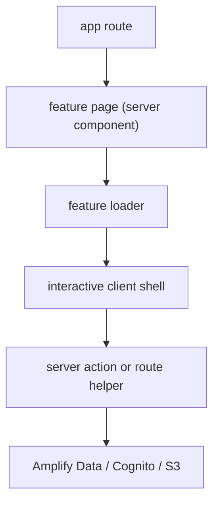

# Architecture

## Design Goal

This repository is optimized for repeatability, not cleverness.

The standard for a good implementation here is:

- a junior engineer can find the right file immediately
- a reviewer can predict where reads, writes, and UI state live
- a new feature can be built by copying one existing slice and renaming it

## Core Principles

1. `app/*` is routing, not business logic
2. each feature owns its own loader, actions, routes, and UI
3. `src/server/*` contains shared infrastructure only
4. `src/lib/*` contains pure reusable helpers only
5. server is the source of truth
6. optimism lives in one client boundary per feature

## Project Shape

```text
src/
  app/
    page.tsx
    login/page.tsx
    signup/page.tsx
    api/
  components/
    ui/
    configure-amplify.tsx
    logout-button.tsx
  features/
    auth/
      components/
      server/
      index.ts
    workspace/
      components/
      server/
      types.ts
      index.ts
  lib/
  server/
```

## Responsibility Map

### `src/app/*`

Use for:

- route entrypoints
- wiring search params into a feature page
- thin API route exports

Do not use for:

- shaping domain data
- data fetching logic
- mutation logic
- optimistic client state

### `src/features/<feature>/components`

Use for:

- feature page entry
- interactive client shell
- presentational subcomponents

Expected pattern:

```text
components/
  <feature>-page.tsx
  <feature>-interactive.tsx
  ...small subparts
```

### `src/features/<feature>/server`

Use for:

- server-side data loading
- server actions
- route-handler helpers

Expected pattern:

```text
server/
  load-<feature>-data.ts
  <feature>-actions.ts
  <feature>-routes.ts
```

### `src/server/*`

Use only for cross-feature infrastructure:

- Amplify server client creation
- auth/session access
- shared error shaping
- shared form parsing

Business rules should not live here.

## Request Lifecycle



## Current Reference Slices

## `auth`

Files to copy when building a login-like feature:

- [src/features/auth/components/authenticator-panel.tsx](/Users/hiroshige.negishi/Documents/Amplify/amplify-playground/src/features/auth/components/authenticator-panel.tsx)
- [src/features/auth/components/auth-shell.tsx](/Users/hiroshige.negishi/Documents/Amplify/amplify-playground/src/features/auth/components/auth-shell.tsx)
- [src/features/auth/server/session-debug.ts](/Users/hiroshige.negishi/Documents/Amplify/amplify-playground/src/features/auth/server/session-debug.ts)

## `workspace`

Files to copy when building a CRUD-heavy feature:

- [src/features/workspace/components/workspace-page.tsx](/Users/hiroshige.negishi/Documents/Amplify/amplify-playground/src/features/workspace/components/workspace-page.tsx)
- [src/features/workspace/server/load-workspace-data.ts](/Users/hiroshige.negishi/Documents/Amplify/amplify-playground/src/features/workspace/server/load-workspace-data.ts)
- [src/features/workspace/components/workspace-interactive.tsx](/Users/hiroshige.negishi/Documents/Amplify/amplify-playground/src/features/workspace/components/workspace-interactive.tsx)
- [src/features/workspace/server/workspace-actions.ts](/Users/hiroshige.negishi/Documents/Amplify/amplify-playground/src/features/workspace/server/workspace-actions.ts)
- [src/features/workspace/server/project-file-routes.ts](/Users/hiroshige.negishi/Documents/Amplify/amplify-playground/src/features/workspace/server/project-file-routes.ts)

## Shared Rules

1. Parse `FormData` with [src/server/form-data.ts](/Users/hiroshige.negishi/Documents/Amplify/amplify-playground/src/server/form-data.ts)
2. Normalize Amplify errors with [src/server/amplify-errors.ts](/Users/hiroshige.negishi/Documents/Amplify/amplify-playground/src/server/amplify-errors.ts)
3. Access auth/session through [src/server/amplify.ts](/Users/hiroshige.negishi/Documents/Amplify/amplify-playground/src/server/amplify.ts)
4. Keep optimistic updates inside `startTransition(...)`
5. End mutations with a server refresh or route refresh to reconcile state

## What Good Looks Like

A new feature is considered aligned when:

- its `page.tsx` is tiny
- its server loader returns already-shaped serializable data
- its interactive shell owns all temporary pending/error/optimistic state
- its route handlers only forward to feature-local server helpers
- the shape matches an existing feature closely enough to copy by analogy
